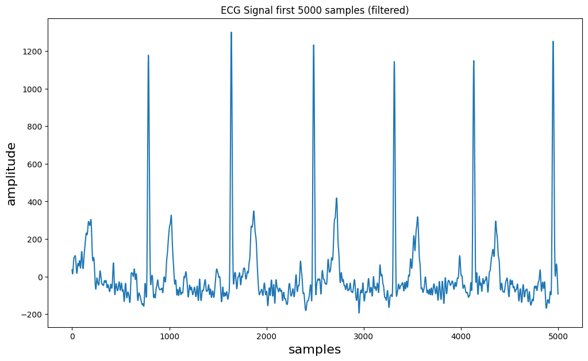
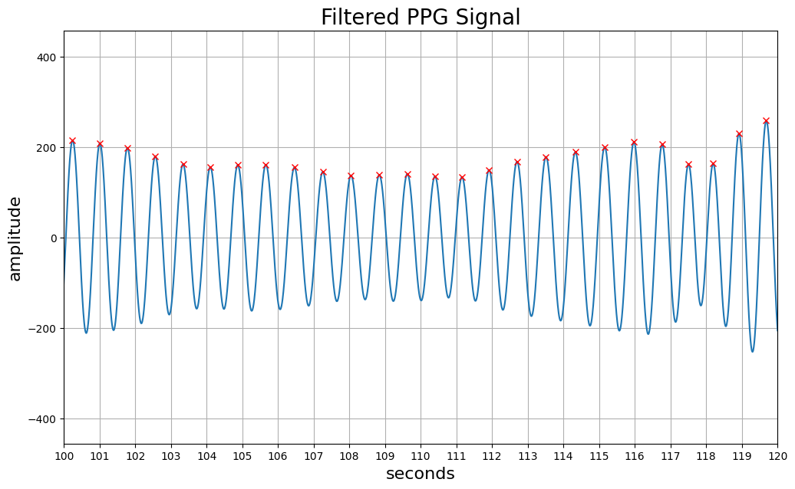
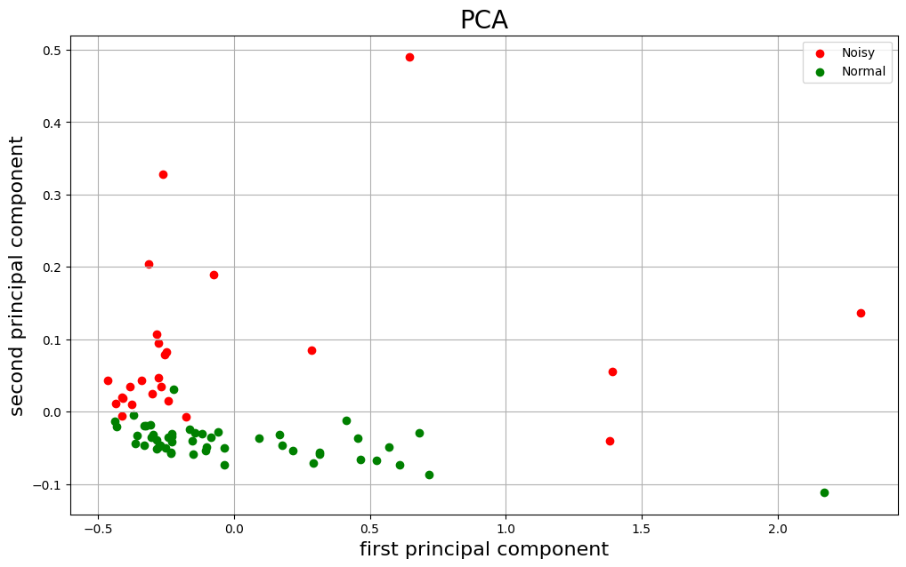

(This repo is now being used as a codex agentic ai practicing, please do not reference any of the content inside this repo.)

# Biosignal Analysis Course Project

An educational, notebook-based exploration of electrocardiogram (ECG),
photoplethysmogram (PPG), and seismocardiogram (SCG) recordings. The three
exercises demonstrate visualization, spectral analysis, digital filtering,
peak detection, feature extraction, and principal component analysis.

> **Scope:** This is a course project with illustrative analyses, not validated
> clinical software. Do not use its results for diagnosis or medical decisions.

## Analysis overview

- **Exercise 2 — ECG:** visualization, Fourier analysis, Butterworth filtering,
  and QRS exploration with BioSPPy.
- **Exercise 3 — PPG:** power spectral density, filtering, peak detection, and
  exploratory heart-rate variability calculations.
- **Exercise 4 — SCG:** segmentation, time- and frequency-domain feature
  extraction, and a two-component PCA visualization.

Each notebook retains its saved plots. These previews are exported unchanged
from selected notebook outputs; they illustrate the workflow, not validated
physiological results. Known methodological limitations are listed below.

| ECG: filtered first 5,000 samples | PPG: filtered signal and detected peaks, 100–120 s |
| --- | --- |
|  |  |



The SCG plot retains the notebook's per-segment feature scaling. It does not
establish classification performance or noise removal. See
[`SCG_REVIEW.md`](SCG_REVIEW.md) for the numerical review and unresolved questions.

## Project structure

| Path | Contents |
| --- | --- |
| `DTEK0042_Exercise_2.ipynb` | ECG visualization, Fourier analysis, Butterworth band-pass filtering, and ECG/QRS analysis with BioSPPy. |
| `DTEK0042_Exercise_3.ipynb` | PPG power spectral density, band-pass filtering, peak detection, and heart-rate and variability calculations. |
| `DTEK0042_Exercise_4_FINAL.ipynb` | SCG segmentation, statistical and spectral feature extraction, and PCA visualization of normal and noisy recordings. |
| `ECG_800hz.txt` | Single-column ECG recording analyzed at 800 Hz. |
| `PPG_record.txt` | Comma-separated timestamp, red, infrared, and green channels. Exercise 3 analyzes the infrared channel at 132 Hz. |
| `dataset/` | Four `Normal_data_*.txt` and four `Noisy_data_*.txt` SCG recordings. Exercise 4 uses the third column (Z-axis) at 200 Hz. |
| `DATA.md` | Verified file shapes, delimiters, known semantics, and undocumented provenance fields. |
| `requirements.txt` | Pinned direct dependencies for the reproducible Python 3.11 environment. |
| `scripts/validate_repository.py` | Dependency-free notebook and numeric-data integrity checks. |
| `scripts/export_previews.py` | Exports selected saved PNG plots to `assets/` for this README. |
| `tests/test_scg_preprocessing.py` | Numerical characterization of the current SCG scaling behavior. |
| `SCG_REVIEW.md` | SCG preprocessing review and limits of the numerical checks. |
| `VALIDATION.md` | Recorded clean-environment execution results and output-curation commands. |

The notebooks are independent entry points; they do not import one another.
There is no standalone application or command-line analysis entry point.

## Reproducible setup

The notebooks were originally saved with Python 3.8.5 metadata. The maintained
environment is now specified for **Python 3.11** in `requirements.txt`; the
pins are intended to keep future installations consistent.

From the repository root, create an isolated environment and install the exact
direct dependency versions:

```sh
python3.11 -m venv .venv
source .venv/bin/activate
python -m pip install --upgrade pip
python -m pip install -r requirements.txt
```

On Windows PowerShell, create and use the environment explicitly instead:

```powershell
py -3.11 -m venv .venv
.\.venv\Scripts\python.exe -m pip install -r requirements.txt
.\.venv\Scripts\python.exe -m notebook
```

The direct dependencies are Jupyter Notebook, IPython, NumPy, SciPy,
Matplotlib, BioSPPy, PeakUtils, pandas, and scikit-learn. IPython is pinned to
a compatible 8.x release because Matplotlib 3.8 still imports an API
removed in IPython 9. PeakUtils is listed explicitly because BioSPPy's ECG
functionality imports it at runtime.

## Usage

Keep the directory structure intact because the notebooks load data through
paths relative to the repository root.

1. Activate the environment created above.
2. Run `python scripts/validate_repository.py` to check notebook syntax and
   the expected numeric data shapes.
3. Start Jupyter with `python -m notebook`.
4. Open an exercise and select the environment's Python kernel.
5. Restart the kernel and run all cells from top to bottom. Later cells depend
   on variables and functions defined earlier in the notebook.

To execute a notebook non-interactively without overwriting its curated saved
outputs:

```sh
mkdir -p /tmp/executed-notebooks
MPLBACKEND=Agg jupyter nbconvert \
  --to notebook \
  --execute DTEK0042_Exercise_2.ipynb \
  --output /tmp/executed-notebooks/DTEK0042_Exercise_2.ipynb \
  --ExecutePreprocessor.timeout=300
```

The GitHub Actions workflow applies the same approach to all three notebooks
on pushes and pull requests.

### Saved-output policy

Curated outputs remain in the notebooks so that plots render on repository
hosting sites. When code or data changes affect a result, rerun the entire
notebook from a fresh kernel, review the result, and commit the updated output
with the code. Temporary `*.nbconvert.ipynb` files are ignored.

Use the inline Matplotlib backend when refreshing saved plots, then run
`python scripts/export_previews.py` to refresh the README images. See
[`VALIDATION.md`](VALIDATION.md) for commands and the latest recorded run.

### Filename note

Exercise 2's written data-import instruction refers to `ECG_800Hz.txt`, but
the committed file—and the path used by its loading cell—is `ECG_800hz.txt`.
The case matters on Linux and other case-sensitive filesystems.

## Data, authorship, and reuse

[`DATA.md`](DATA.md) records only facts that can be verified from the files and
notebooks. The repository does not identify the recordings' external source,
physical units, collection protocol, participant status, or consent terms.

The notebooks name Juha Virta, Amin Rezaei, and Yu-Hao Tsai as group members.
No open-source or data license has been granted. Read [`RIGHTS.md`](RIGHTS.md)
before copying, redistributing, or adapting the code, prose, or recordings.

## Validation and known limitations

`scripts/validate_repository.py` checks that the notebooks are valid notebook
format 4 documents, that their code cells parse as Python, and that all expected
data files contain finite numeric values with the expected number of columns.
CI additionally executes every notebook from a clean kernel. These checks test
structural reproducibility; they do not validate physiological conclusions.

Run `python -m unittest discover -s tests -v` for the SCG numerical checks,
which also run in CI. They characterize the current preprocessing limitation;
passing them does not endorse that method.

The following analysis questions remain intentionally documented rather than
silently changed:

- Exercise 3's interval averaging and RMSSD calculation need methodological
  review. Its variability values remain in seconds although the exercise asks
  for milliseconds.
- Exercise 4 standardizes each segment's feature vector individually before
  PCA, rather than standardizing feature columns across all segments.
- The meaning of the dataset labels `Normal` and `Noisy` is not documented
  beyond the filenames and notebook instructions.

Exercise 4 now discovers noisy and normal files independently with
`pathlib.Path`, sorts each group, and derives labels from filenames. It no
longer depends on Windows path separators or unspecified glob ordering.
